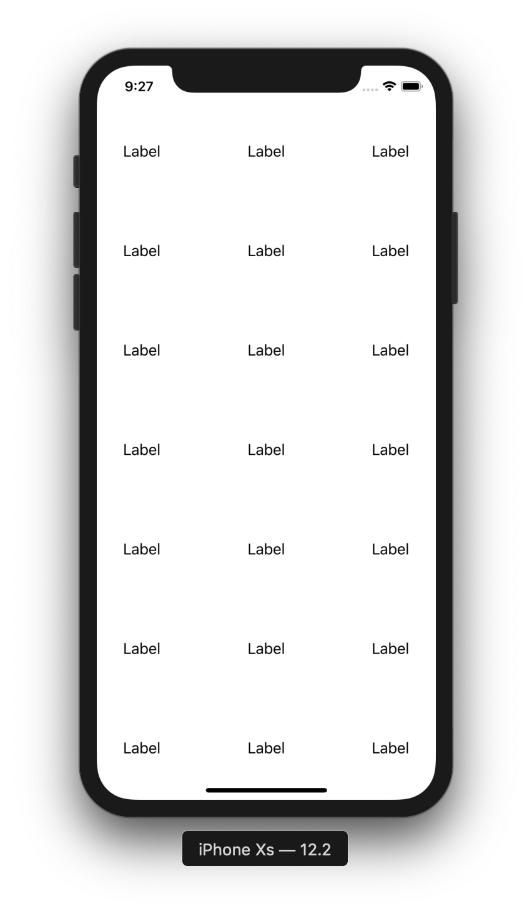

# CollectionView 1

目標：製作基本的CollectionView

## 圖示



## 步驟

新增一個 ```UICollectionViewCell```

註冊CollectionViewCell

```swift
collectionView.register(UINib(nibName: "CollectionViewCell", bundle: nil), forCellWithReuseIdentifier: "CollectionViewCell")
```

實作 ```UICollectionViewDelegate``` 與 ```UICollectionViewDataSource``` 與 ```UICollectionViewDelegateFlowLayout```

```swift
extension ViewController: UICollectionViewDelegate, UICollectionViewDataSource, UICollectionViewDelegateFlowLayout {
    func numberOfSections(in collectionView: UICollectionView) -> Int {
        return 1
    }
    
    func collectionView(_ collectionView: UICollectionView, numberOfItemsInSection section: Int) -> Int {
        return 30
    }
    
    func collectionView(_ collectionView: UICollectionView, layout collectionViewLayout: UICollectionViewLayout, sizeForItemAt indexPath: IndexPath) -> CGSize {
        return CGSize(width: 100, height: 100)
    }
    
    func collectionView(_ collectionView: UICollectionView, cellForItemAt indexPath: IndexPath) -> UICollectionViewCell {
        let cell =  collectionView.dequeueReusableCell(withReuseIdentifier: "CollectionViewCell", for: indexPath) as! CollectionViewCell
        
        return cell
    }
}
```

在Storyboard上連結CollectionView的dataSource與delegate


