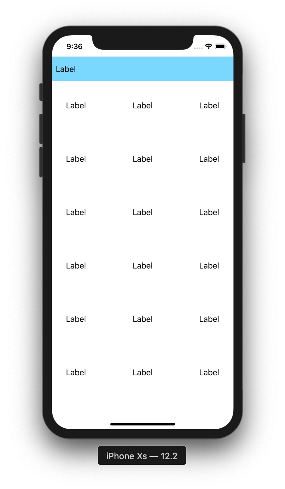

# CollectionView 2

目標：製作含有Header的CollectionView

## 圖示



## 步驟

新增一個 ```UICollectionViewCell``` 與 ```UICollectionReusableView```

註冊CollectionViewCell與CollectionReusableView

```swift
collectionView.register(UINib(nibName: "CollectionReusableView", bundle: nil), forSupplementaryViewOfKind: UICollectionView.elementKindSectionHeader, withReuseIdentifier: "CollectionReusableView")
collectionView.register(UINib(nibName: "CollectionViewCell", bundle: nil), forCellWithReuseIdentifier: "CollectionViewCell")    
```

實作 ```UICollectionViewDelegate``` 與 ```UICollectionViewDataSource``` 與 ```UICollectionViewDelegateFlowLayout```

```swift

extension ViewController: UICollectionViewDelegate, UICollectionViewDataSource, UICollectionViewDelegateFlowLayout {
    func numberOfSections(in collectionView: UICollectionView) -> Int {
        return 2
    }
    
    //Header Size
    func collectionView(_ collectionView: UICollectionView, layout collectionViewLayout: UICollectionViewLayout, referenceSizeForHeaderInSection section: Int) -> CGSize
    {
        return CGSize(width: collectionView.frame.width, height: 50)
    }
    
    //Header Cell
    func collectionView(_ collectionView: UICollectionView, viewForSupplementaryElementOfKind kind: String, at indexPath: IndexPath) -> UICollectionReusableView
    {
        let cell = collectionView.dequeueReusableSupplementaryView(ofKind: UICollectionView.elementKindSectionHeader, withReuseIdentifier: "CollectionReusableView", for: indexPath)
        
        return cell
    }
    
    func collectionView(_ collectionView: UICollectionView, numberOfItemsInSection section: Int) -> Int {
        return 30
    }
    
    func collectionView(_ collectionView: UICollectionView, layout collectionViewLayout: UICollectionViewLayout, sizeForItemAt indexPath: IndexPath) -> CGSize {
        return CGSize(width: 100, height: 100)
    }
    
    func collectionView(_ collectionView: UICollectionView, cellForItemAt indexPath: IndexPath) -> UICollectionViewCell {
        let cell =  collectionView.dequeueReusableCell(withReuseIdentifier: "CollectionViewCell", for: indexPath) as! CollectionViewCell
        
        return cell
    }
}
```

在Storyboard上連結CollectionView的dataSource與delegate


