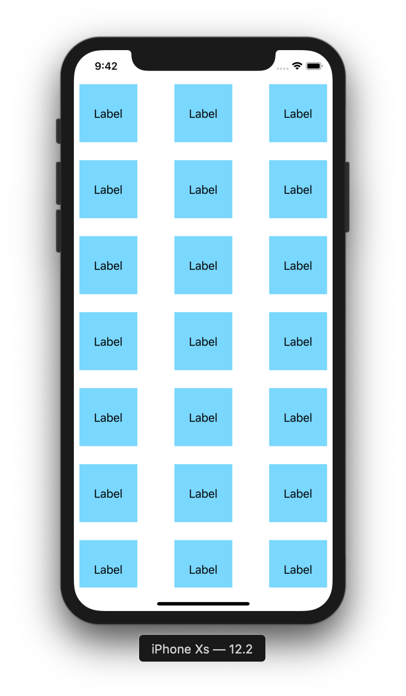

# CollectionView 3

目標：製作可以拖曳排序的CollectionView

## 圖示



## 步驟

新增一個 ```UICollectionViewCell```

註冊CollectionViewCell

```swift
collectionView.register(UINib(nibName: "CollectionViewCell", bundle: nil), forCellWithReuseIdentifier: "CollectionViewCell")   
```

實作 ```UICollectionViewDelegate``` 與 ```UICollectionViewDataSource``` 與 ```UICollectionViewDelegateFlowLayout```

```swift
extension ViewController: UICollectionViewDelegate, UICollectionViewDataSource, UICollectionViewDelegateFlowLayout {
    func numberOfSections(in collectionView: UICollectionView) -> Int {
        return 1
    }
    
    func collectionView(_ collectionView: UICollectionView, numberOfItemsInSection section: Int) -> Int {
        return 30
    }
    
    func collectionView(_ collectionView: UICollectionView, layout collectionViewLayout: UICollectionViewLayout, sizeForItemAt indexPath: IndexPath) -> CGSize {
        return CGSize(width: 100, height: 100)
    }
    
    func collectionView(_ collectionView: UICollectionView, cellForItemAt indexPath: IndexPath) -> UICollectionViewCell {
        let cell =  collectionView.dequeueReusableCell(withReuseIdentifier: "CollectionViewCell", for: indexPath) as! CollectionViewCell
        
        return cell
    }
    
    //是否可以移動cell
    func collectionView(_ collectionView: UICollectionView, canMoveItemAt indexPath: IndexPath) -> Bool {
        return true
    }
    
    //移動後
    func collectionView(_ collectionView: UICollectionView, moveItemAt sourceIndexPath: IndexPath, to destinationIndexPath: IndexPath)
    {
        print(sourceIndexPath.row, destinationIndexPath.row)
        
        collectionView.reloadItems(at: collectionView.indexPathsForVisibleItems)
    }
}
```

在Storyboard上連結CollectionView的dataSource與delegate

新增一個長按的手勢

```swift
let longPressGestureRecognizer = UILongPressGestureRecognizer(target: self, action: #selector(handleLongPressGest(gesture:)))
collectionView.addGestureRecognizer(longPressGestureRecognizer)
```

```swift
@objc func handleLongPressGest(gesture: UILongPressGestureRecognizer) {
	print(gesture.state.rawValue)
	
	switch gesture.state {
	case .began:
		//取得選取的cell
		let point = gesture.location(in: collectionView)
		let selectedIndexPath = collectionView.indexPathForItem(at: point)
		
		//
		collectionView.beginInteractiveMovementForItem(at: selectedIndexPath!)
		
		break
		
	case .changed:
		let point = gesture.location(in: collectionView)
		collectionView.updateInteractiveMovementTargetPosition(point)
		
		break
		
	case .ended:
		collectionView.endInteractiveMovement()
            
       break
       
   default:
       collectionView.cancelInteractiveMovement()
            
   }
}
```
