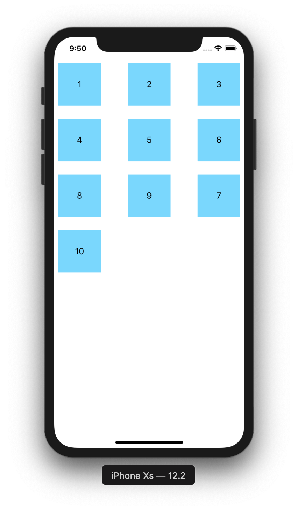

# CollectionView 4

目標：製作可以拖曳排序的CollectionView，使用Drag與Drop實作

## 圖示



## 步驟

新增一個 ```UICollectionViewCell```

註冊CollectionViewCell

```swift
collectionView.register(UINib(nibName: "CollectionViewCell", bundle: nil), forCellWithReuseIdentifier: "CollectionViewCell")   
```

開啟Drag模式

```swift
collectionView.dragInteractionEnabled = true
```

實作 ```UICollectionViewDelegate``` 與 ```UICollectionViewDataSource``` 與 ```UICollectionViewDelegateFlowLayout``` 與 ```UICollectionViewDragDelegate``` 與 ```UICollectionViewDropDelegate```

```swift
extension ViewController: UICollectionViewDelegate, UICollectionViewDataSource, UICollectionViewDelegateFlowLayout, UICollectionViewDragDelegate, UICollectionViewDropDelegate
{
    func numberOfSections(in collectionView: UICollectionView) -> Int {
        return 1
    }
    
    func collectionView(_ collectionView: UICollectionView, numberOfItemsInSection section: Int) -> Int {
        return collectionArray.count
    }
    
    func collectionView(_ collectionView: UICollectionView, layout collectionViewLayout: UICollectionViewLayout, sizeForItemAt indexPath: IndexPath) -> CGSize {
        return CGSize(width: 100, height: 100)
    }
    
    func collectionView(_ collectionView: UICollectionView, cellForItemAt indexPath: IndexPath) -> UICollectionViewCell {
        let cell =  collectionView.dequeueReusableCell(withReuseIdentifier: "CollectionViewCell", for: indexPath) as! CollectionViewCell
        
        cell.label.text = String(collectionArray[indexPath.row])
        
        return cell
    }
    
    func collectionView(_ collectionView: UICollectionView, itemsForBeginning session: UIDragSession, at indexPath: IndexPath) -> [UIDragItem] {
        let s = NSString(string: "test")
        
        let dragItem = UIDragItem(itemProvider: NSItemProvider(object: s))
        
        return [dragItem]
    }
    
    func collectionView(_ collectionView: UICollectionView, canHandle session: UIDropSession) -> Bool {
        return true
    }
    
    func collectionView(_ collectionView: UICollectionView, dropSessionDidUpdate session: UIDropSession, withDestinationIndexPath destinationIndexPath: IndexPath?) -> UICollectionViewDropProposal
    {
        return UICollectionViewDropProposal(operation: .move, intent: .insertAtDestinationIndexPath)
    }
    
    func collectionView(_ collectionView: UICollectionView, performDropWith coordinator: UICollectionViewDropCoordinator) {
        let sourceIndexPath = coordinator.items.first?.sourceIndexPath
        let destinationIndexPath = coordinator.destinationIndexPath
        
        print(sourceIndexPath?.row, destinationIndexPath?.row)
        
        collectionView.performBatchUpdates({
            let item = self.collectionArray[(sourceIndexPath?.row)!]
            
            self.collectionArray.remove(at: (sourceIndexPath?.row)!)
            self.collectionArray.insert(item, at: (destinationIndexPath?.row)!)
            collectionView.moveItem(at: sourceIndexPath!, to: destinationIndexPath!)
            
        }, completion: nil)
        
        coordinator.drop((coordinator.items.first?.dragItem)!, toItemAt: destinationIndexPath!)
    }
}
```

在Storyboard上連結CollectionView的dataSource與delegate
