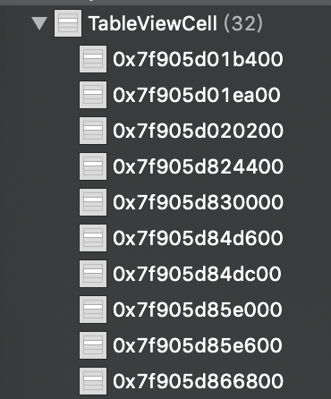

# Memory Leak

目標：討論在custom table cell delegate中產生的memory leak

## 起因

一般來說，實作custom cell的delegate時，會這樣寫：

```swift
protocol TableViewCellDelegate {
    func tableViewCellClickButton(tag: Int)
}

var delegate: TableViewCellDelegate?

```

宣告一個protocol與delegate，然後在tableview裡頭指定：

```swift
func tableView(_ tableView: UITableView, cellForRowAt indexPath: IndexPath) -> UITableViewCell {
    let cell = tableView.dequeueReusableCell(withIdentifier: "TableViewCell", for: indexPath) as! TableViewCell
    cell.delegate = self
    cell.tag = indexPath.row
        
    return cell
}

```

最後就可以在ViewController裡實作protocol的函示：

```swift
extension ViewController: TableViewCellDelegate {
    func tableViewCellClickButton(tag: Int) {
        print(tag)
    }
}
```

但在Xcode的leaked block中發現，當讀取此TableView越多次時，TableViewCell所佔用的記憶體卻越來越多，並沒有減少。



關鍵在於這一行：

```
cell.delegate = self
```

ViewController指到custom cell，而custom cell的delegate又指回ViewController，造成一個circle，所以當ViewController被釋放掉時，custom cell的delegate並沒有被釋放掉。

## 解決

將delegate宣告為weak即可解決：

```swift
weak var delegate: TableViewCellDelegate?
```

同時更改protocol為：

```swift
protocol TableViewCellDelegate: NSObjectProtocol {
    func tableViewCellClickButton(tag: Int)
}
```