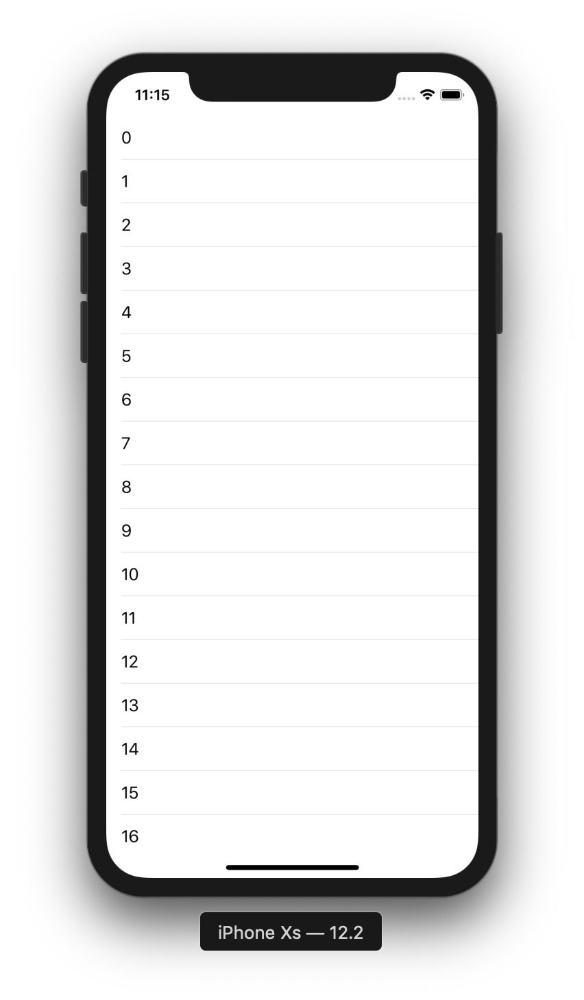

# TableView 1

目標：製作一個基本的Table View

## 圖示



## 程式碼

```swift
extension ViewController: UITableViewDataSource, UITableViewDelegate {
    func numberOfSections(in tableView: UITableView) -> Int {
        return 1
    }
    
    func tableView(_ tableView: UITableView, numberOfRowsInSection section: Int) -> Int {
        return 20
    }
    
    func tableView(_ tableView: UITableView, heightForRowAt indexPath: IndexPath) -> CGFloat {
        return 44.0
    }
    
    func tableView(_ tableView: UITableView, cellForRowAt indexPath: IndexPath) -> UITableViewCell {
        var cell = tableView.dequeueReusableCell(withIdentifier: "cell")
        if cell == nil {
            cell = UITableViewCell(style: .default, reuseIdentifier: "cell")
        }
        
        cell?.textLabel?.text = String(indexPath.row)
        
        return cell!
    }
    
    func tableView(_ tableView: UITableView, didSelectRowAt indexPath: IndexPath) {
        tableView.deselectRow(at: indexPath, animated: true)
        
        print(indexPath.row)
    }
}
```


