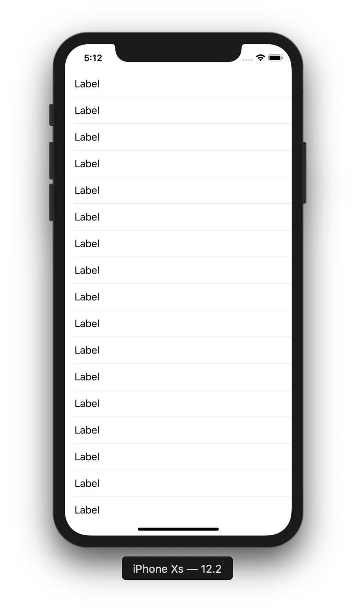

# TableView 2

目標：製作客製化Cell的TableView

## 圖示



## 步驟

新增一個 ```UITableViewCell```

註冊Cell：

```swift
tableView.register(UINib(nibName: "TableViewCell", bundle: nil), forCellReuseIdentifier: "TableViewCell")
```

實作TableView的dataSource與delegate：

```swift
extension ViewController: UITableViewDataSource, UITableViewDelegate {
    func numberOfSections(in tableView: UITableView) -> Int {
        return 1
    }
    
    func tableView(_ tableView: UITableView, numberOfRowsInSection section: Int) -> Int {
        return 20
    }
    
    func tableView(_ tableView: UITableView, heightForRowAt indexPath: IndexPath) -> CGFloat {
        return 44.0
    }
    
    func tableView(_ tableView: UITableView, cellForRowAt indexPath: IndexPath) -> UITableViewCell {
        let cell = tableView.dequeueReusableCell(withIdentifier: "TableViewCell", for: indexPath) as! TableViewCell
        
        return cell
    }
    
    func tableView(_ tableView: UITableView, didSelectRowAt indexPath: IndexPath) {
        tableView.deselectRow(at: indexPath, animated: true)
        
        print(indexPath.row)
    }
}
```

在Storyboard上連結TableView的dataSource與delegate

