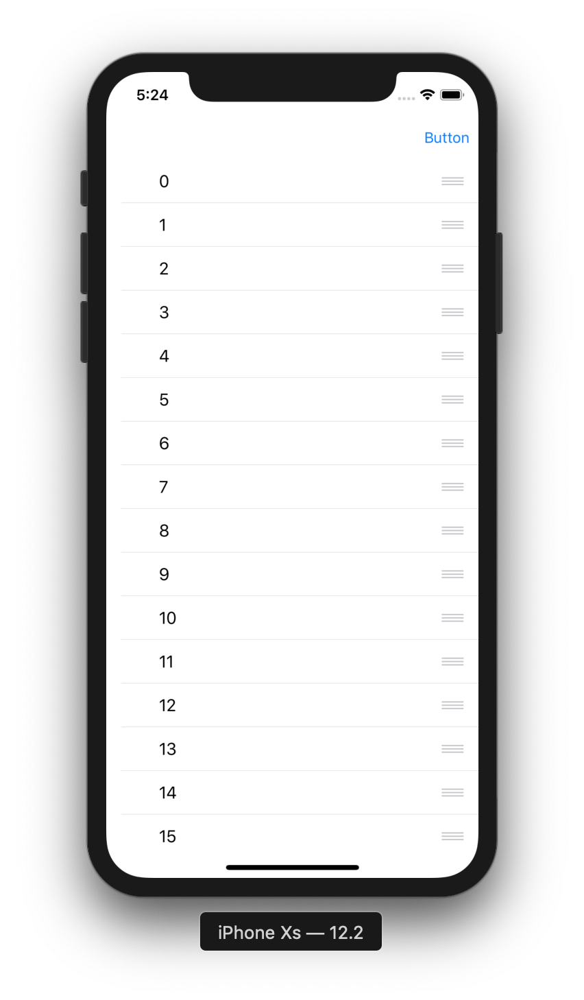

# TableView 4

目標：製作可以手滑拖曳排序TableView

## 圖示



## 步驟

實作TableView的dataSource與delegate：

```swift
extension ViewController: UITableViewDataSource, UITableViewDelegate {
    func numberOfSections(in tableView: UITableView) -> Int {
        return 1
    }
    
    func tableView(_ tableView: UITableView, numberOfRowsInSection section: Int) -> Int {
        return 20
    }
    
    func tableView(_ tableView: UITableView, heightForRowAt indexPath: IndexPath) -> CGFloat {
        return 44.0
    }
    
    func tableView(_ tableView: UITableView, cellForRowAt indexPath: IndexPath) -> UITableViewCell {
        var cell = tableView.dequeueReusableCell(withIdentifier: "cell")
        if cell == nil {
            cell = UITableViewCell(style: .default, reuseIdentifier: "cell")
        }
        
        cell?.textLabel?.text = String(indexPath.row)
        
        return cell!
    }
    
    func tableView(_ tableView: UITableView, didSelectRowAt indexPath: IndexPath) {
        tableView.deselectRow(at: indexPath, animated: true)
        
        print(indexPath.row)
    }
    
    func tableView(_ tableView: UITableView, editingStyleForRowAt indexPath: IndexPath) -> UITableViewCell.EditingStyle {
        return UITableViewCell.EditingStyle.none
    }
    
    func tableView(_ tableView: UITableView, moveRowAt sourceIndexPath: IndexPath, to destinationIndexPath: IndexPath) {
        print(sourceIndexPath.row, destinationIndexPath.row)
    }
}
```

將tableView的editing設定為true，即可開啟排序功能

```swift
tableView.setEditing(true, animated: true)
```

