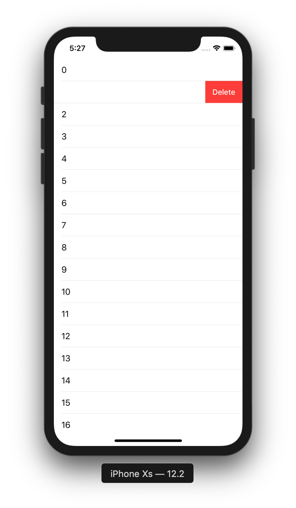
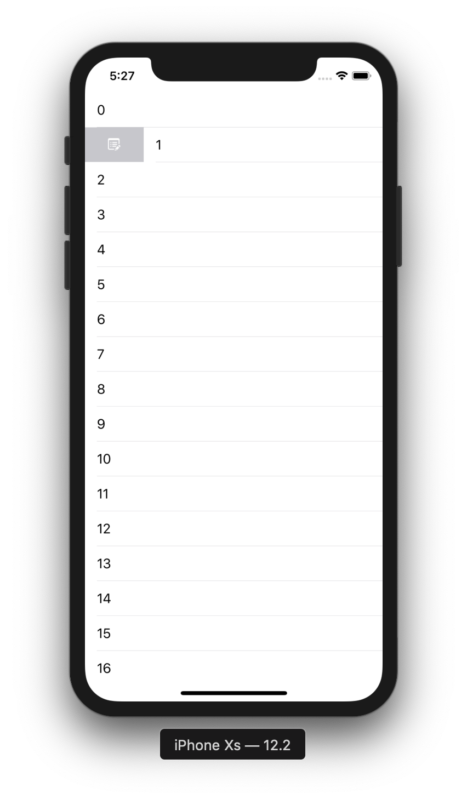

# TableView 5

目標：製作可以左右滑動Cell的TableView

## 圖示




## 步驟

在TableView的dataSource與delegate，新增以下實作程式：

```swift
//開啟向左滑
func tableView(_ tableView: UITableView, canEditRowAt indexPath: IndexPath) -> Bool {
	return true
}
    
//開啟向左滑，按下事件
func tableView(_ tableView: UITableView, commit editingStyle: UITableViewCell.EditingStyle, forRowAt indexPath: IndexPath) {
	print(indexPath.row)
}
    
func tableView(_ tableView: UITableView, leadingSwipeActionsConfigurationForRowAt indexPath: IndexPath) -> UISwipeActionsConfiguration? {
	let contextualAction = UIContextualAction(style: .normal, title: nil, handler: { (action, view, completionHandler) in
		completionHandler(true)
            
	})
	contextualAction.image = UIImage(named: "edit")
        
    return UISwipeActionsConfiguration(actions: [contextualAction])
}
```
